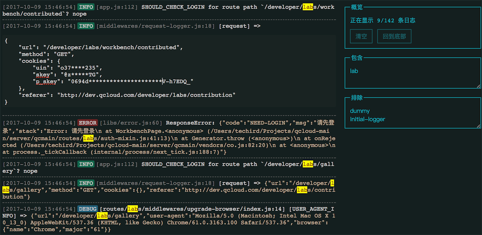

开发日志阅读器（DLR）
=================

本工具适合阅读开发环境的日志。

传统的开发日志在终端输出，很多时候对日志进行跟踪、筛选、查找、格式化等工作会浪费较大的精力。

DLR (Development Log Reader) 把本地开发进程的输出内容通过 WebSocket 重定向到浏览器，支持实时查看、筛选、查找以及 JSON 自动识别和格式化工作，可以大幅提升日志阅读的效率。



## 安装

```
npm install dev-log-reader --global
```

## 使用

``` 
dlr [-p,--port=number] [-t,--title=title] -- command
```

如：

```
dlr -p 12345 -t MY_PROJECT -- yarn dev
```